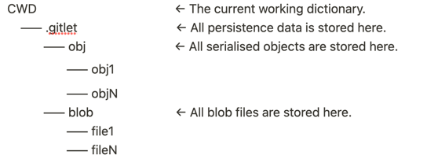

# Gitlet Design Document

**Xin (Daniel) Feng**:

- Finished in June, 2023

## Overall

This is an implementation of a simplified version-control system that mimics some of the basic features of the popular system Git.

The features include:
- `commit`
- `check out`
- `branch`
- `log`
- `merge`

## Algorithms

Use the BFS to find the LCA (Least Common Ancestors) of two commits when merging.

O(n), Pseudocode:

```
visited = [];

deque = [];
deque.addLast(1st commit);
deque.addLast(2nd commit);

while deque.notEmpty:
    curr = deque.removeFirst();
    if curr in visited:
        return curr;  //found
    visited.add(curr);
    deque.addLast(parents);
```

## Classes and Data Structures

### Main

This is the entry point to our program.

It takes in arguments from the command line and based on the command (the first element of the `args` array) calls the corresponding command in `Repository` which will actually execute the logic of the command.

It also validates the arguments based on the command to ensure that enough arguments were passed in.

Read the helpful java doc for more information.

### Repository

This class is the main logic of Gitlet. This file will handle all of the actual Gitlet commands, and additional error checking.

It will also be responsible for setting up some persistence. This includes creating the `.gitlet` folder as well as the folder and file where we store all `fields` and the blob files.

This class defers all `commit` specific logic to the `Commit` class; `blobs` specific logic to the `Blobs` class; `stage` specific logic to the `Stage` class; `branches` specific logic to the `Branches` class;

#### Fields

- `CWD` : the current working folder.
- `GITLET_DIR` : the persistence folder: .git
- `OBJ_DIR` : the folder for serialised objects.
- `blobs` : a  instance of the `Blobs` class.
- `commits` : a  instance of the `Commit` class.
- `branches`   : a  instance of the `Branches` class.

### Commit

This class manages the commits.

#### Fields

- `COMMITS_FILE` : the persistence file name of the serialised object.
- `SHORT_COMMITS_FILE` : the persistence file name of the serialised object.
- `INIT_HASH` : the hash value of init commit.
- `INIT_MSG` : the message of init commit.
- `commits` : a `TreeMap` keeps the hash value of the commits and the points to the `Cmt` instances.
- `shortCommits`   : a `TreeMap` keeps the shorten hash value and the full hash value.

### Cmt (Nested Class)

a data structure of a commit.

#### Fields

- `message` : the message of the commit.
- `timeStamp` : the time stamp of the commit time.
- `hash` : the hash value of the commit.
- `tree` : a  `TreeMap` saves the name and hash value of tracked files.
- `parent` : a  `String[]`saves the at most 2 parents of the commit.

### Blobs

This class manages the blob files.

Every file has several copies if there are different versions.

Every copy will be saved under the BLOB_DIR with the name of its Hash Code.

#### Fields

- `BLOB_DIR` : the folder of blob files
- `BLOBS_FILE` : the persistence file name of the serialised object.
- `blobs` : the `TreeSet` keeps the hash value of blob files.

### Branches

This class manages the branches.

#### Fields

- `BRANCHES_FILE` : the persistence file name of the serialised object.
- `CURR_BRANCH_FILE` : the persistence file name of the serialised object.
- `DEFAULT_BRANCH` : set to `master` as default value.
- `branches` : the `TreeMap` keeps the branches’ name and the hash codes of their head point.
- `currBranch` : tracks the current active branch.

### Stage

This class manages the branches.

#### Fields

- `STAGE_FILE` : the persistence file name of the serialised object.
- `REMOVED_STAGE_FILE` : the persistence file name of the serialised object.
- `stage` : the `TreeMap` keeps the staged files’ name and their hash value of current version.
- `removed` : the `TreeSet` keeps the staged removed files’ name.

### Dumpable

This class is an interface that define a `dump` method to print the obj.

Provided by UC Berkeley.

### DumpObj

This class helps the debug by printing the Objects that have implemented the `Dumpable` interface from files.

Provided by UC Berkeley.

### GitletException

This class defines a general exception indicating a Gitlet error.

Provided by UC Berkeley.

### Utils

This class contains 11 utility methods as follows:

| sha1 | restrictedDelete | readContents | readContentsAsString |
| --- | --- | --- | --- |
| writeContents | readObject | writeObject | plainFilenamesIn |
| join | serialize | error |  |

Read the helpful java doc for more information.

Provided by UC Berkeley.

## Persistence

The directory structure looks like this:

